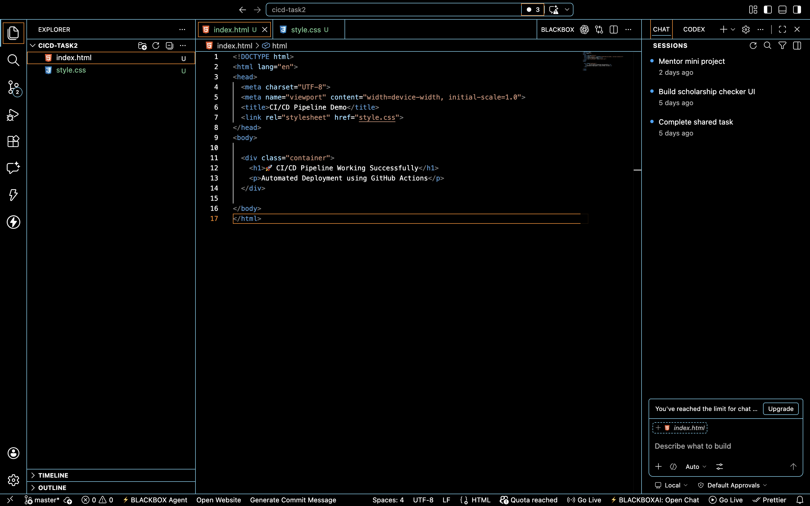
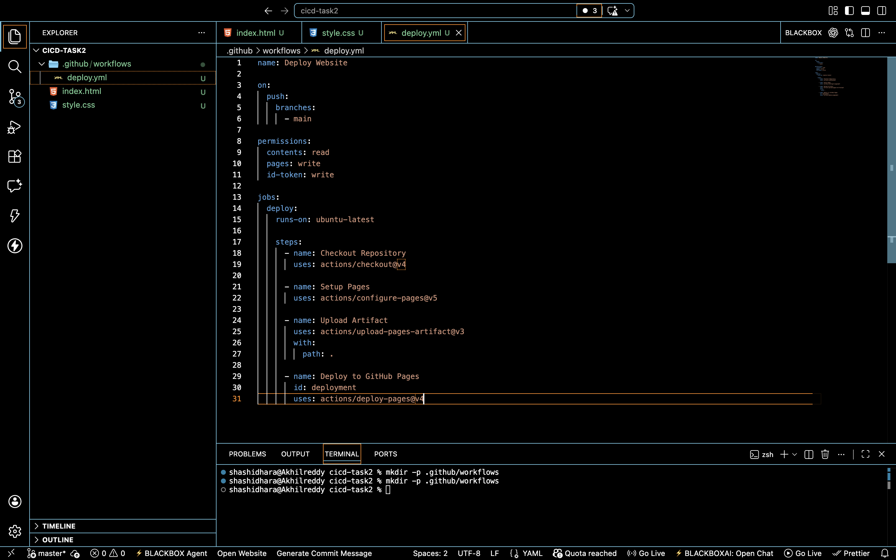
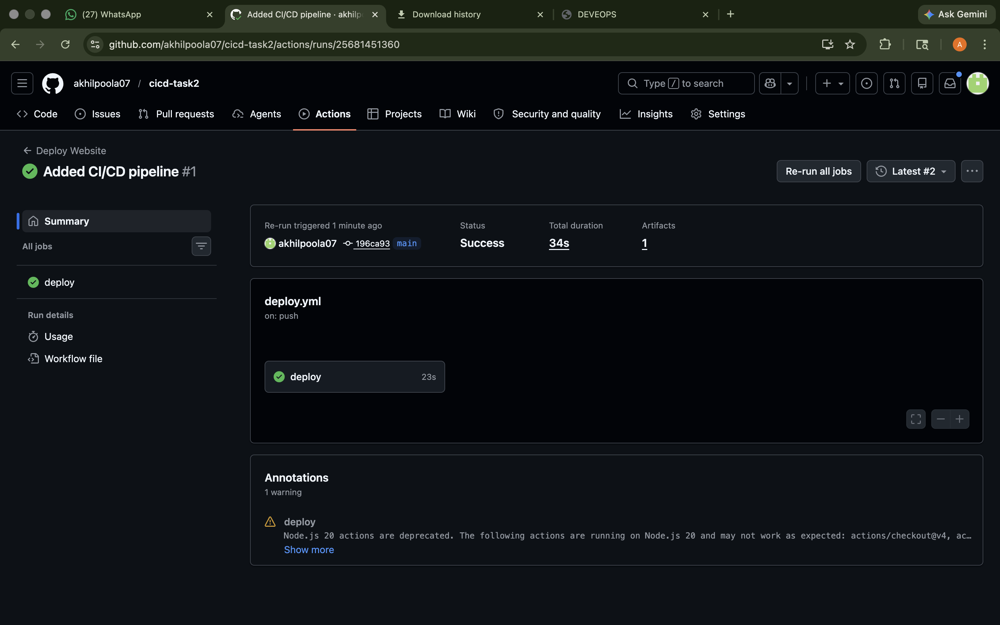
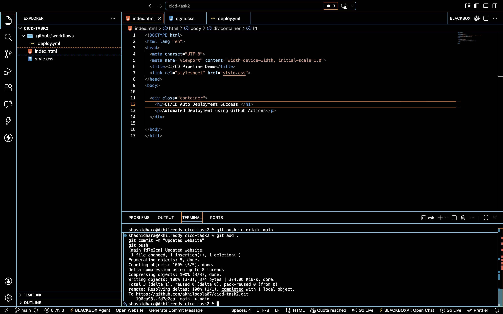

# 🚀 CI/CD Pipeline Setup using GitHub Actions

## 📌 DevOps Internship - Task 2

This project was completed as part of the DevOps Internship program.  
The objective of this task is to build a complete CI/CD pipeline using GitHub Actions to automate the deployment of a web application.

---

# 📖 Project Objective

The main goal of this project is to demonstrate:

- Continuous Integration (CI)
- Continuous Deployment (CD)
- Automated GitHub Actions Workflow
- Automated Deployment using GitHub Pages
- Real-time deployment after every code push

---

# 🛠️ Technologies Used

| Technology | Purpose |
|------------|---------|
| HTML5 | Structure of the web page |
| CSS3 | Styling the web page |
| Git | Version control |
| GitHub | Repository hosting |
| GitHub Actions | CI/CD automation |
| GitHub Pages | Deployment & hosting |

---

# 📂 Project Structure

```text
cicd-task2/
│── index.html
│── style.css
│── README.md
│
├── screenshots/
│   ├── project-files.png
│   ├── workflow-file.png
│   ├── successful-push.png
│   ├── pages-enabled.png
│   ├── pipeline-success.png
│   ├── live-website.png
│   └── auto-redeployment.png
│
└── .github/
    └── workflows/
        └── deploy.yml
```

---

# ⚙️ CI/CD Pipeline Workflow

The CI/CD pipeline works as follows:

1. Developer pushes code to GitHub repository
2. GitHub Actions automatically detects the push
3. Workflow starts execution
4. Repository files are uploaded
5. Website is deployed automatically
6. GitHub Pages updates the live website

---

# 🚀 GitHub Actions Workflow File

The workflow configuration file is located at:

```text
.github/workflows/deploy.yml
```

---

# 📄 Complete Workflow Configuration

```yaml
name: Deploy Website

on:
  push:
    branches:
      - main

permissions:
  contents: read
  pages: write
  id-token: write

jobs:
  deploy:
    runs-on: ubuntu-latest

    steps:
      - name: Checkout Repository
        uses: actions/checkout@v4

      - name: Setup GitHub Pages
        uses: actions/configure-pages@v5

      - name: Upload Website Files
        uses: actions/upload-pages-artifact@v3
        with:
          path: .

      - name: Deploy Website
        id: deployment
        uses: actions/deploy-pages@v4
```

---

# 🌐 Website Files

## 📄 index.html

```html
<!DOCTYPE html>
<html lang="en">
<head>
  <meta charset="UTF-8">
  <meta name="viewport" content="width=device-width, initial-scale=1.0">
  <title>CI/CD Pipeline Demo</title>
  <link rel="stylesheet" href="style.css">
</head>
<body>

  <div class="container">
    <h1>🚀 CI/CD Pipeline Working Successfully</h1>
    <p>Automated Deployment using GitHub Actions</p>
  </div>

</body>
</html>
```

---

## 🎨 style.css

```css
body{
    margin:0;
    padding:0;
    font-family:Arial, sans-serif;
    background:#111827;
    color:white;
    display:flex;
    justify-content:center;
    align-items:center;
    height:100vh;
}

.container{
    text-align:center;
}
```

---

# 📸 Screenshots

## 1️⃣ Project Files



---

## 2️⃣ GitHub Actions Workflow File



---

## 5️⃣ Successful CI/CD Pipeline Execution



---

## 7️⃣ Automatic Redeployment After Push



---

# 🌐 Live Website

## 🔗 Deployment URL

```text
https://akhilpoola07.github.io/cicd-task2/
```

---

# 📚 Git Commands Used

## Initialize Repository

```bash
git init
```

---

## Add Files

```bash
git add .
```

---

## Commit Changes

```bash
git commit -m "Added CI/CD pipeline"
```

---

## Push Code

```bash
git push
```

---

# 🔥 Features

✅ Automated CI/CD Pipeline  
✅ GitHub Actions Integration  
✅ Automatic Deployment  
✅ Continuous Integration  
✅ Continuous Deployment  
✅ Live Website Hosting  
✅ Automatic Redeployment on Every Push  

---

# 🧪 Testing the Pipeline

The pipeline was tested successfully by:

1. Updating website content
2. Pushing changes to GitHub
3. Automatically triggering deployment
4. Verifying live website updates

This confirmed successful CI/CD automation.

---

# 📖 Learning Outcomes

Through this project, I learned:

- CI/CD pipeline concepts
- GitHub Actions workflow automation
- Automated deployment process
- GitHub Pages hosting
- DevOps fundamentals
- Continuous Deployment workflows

---

# 👨‍💻 Author

## Poola Akhil

- GitHub: https://github.com/akhilpoola07
- LinkedIn: https://www.linkedin.com/in/akhilpoola07

DevOps Internship Task Submission

---
---

# ⭐ Conclusion

This project demonstrates a fully functional CI/CD pipeline using GitHub Actions and GitHub Pages.

Every code push automatically triggers deployment, showcasing real-world DevOps automation and deployment practices.

---
